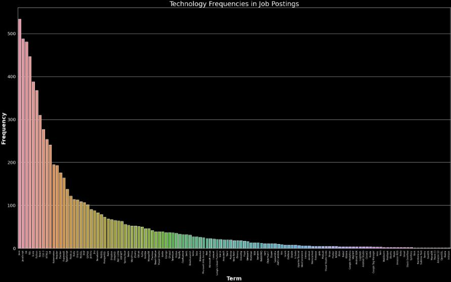
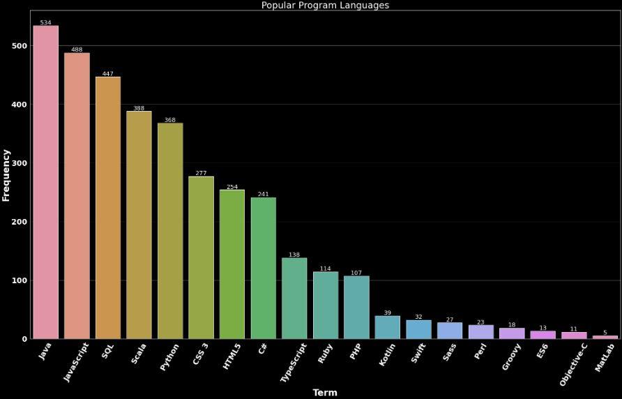
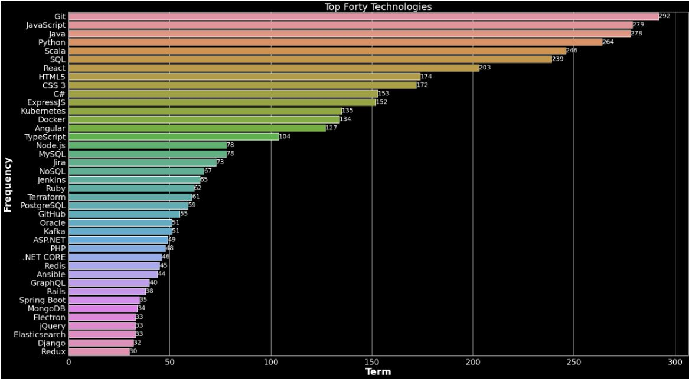

# Tech Spotlight

## Project Description

Welcome to Tech Spotlight. The goal of this project is to search through relevant job postings and find the frequency of technologies associated with those jobs.

This is achieved in two parts: a scraper that scrapes data off Indeed.com with four queries, job title, location, age of posting, and a number of jobs to scrape. This produces a CSV file which can be processed within a  Kaggle notebook, that tells the story about what technologies, frameworks, and libraries were found and how frequently they were posted.

Enabling and user to get hyper focused insights about the job market and they are interested in, as it pertains to software development
___
## Display


Example of output after csv file processed by kaggle notebook

### Full Dataset from Term Detection



### Popular Program languages



### Top Forty Technologies


___

## Project Authors

**Team Spotlight**

- Benjamin Carter: [GitHub](https://github.com/MotoBenny) and [LinkedIn](https://www.linkedin.com/in/benjamin-carter-dev/)

- Nicholas Mercado: [GitHub](https://github.com/Nicholas-Mercado) and [LinkedIn](https://www.linkedin.com/in/nicholasmercado/)

- Christopher Yamas: [GitHub](https://github.com/chrisyamas)  and [LinkedIn](https://www.linkedin.com/in/chrisyamas/)

- Eden Brekke: [GitHub](https://github.com/eden-brekke) and [LinkedIn](https://www.linkedin.com/in/eden-brekke/)

___

## Disclaimers

Possible known bug with Windows Native, in writing files.

Term Selection is not all inclusive. (Feel free to add more terms to the Tech_term list in the datasets folder to further customize your search!)

Make sure you're running python 3.10

This data is intended for personal research purpose and not as a single source of truth.

We cannot account for the validity of the data.

This is a learning project and is not 100% flushed out.

___

## How to install/Use

### Scraper

```py
    git clone https://github.com/regex-rejects/tech-spotlight.git
```

Create visual python environment (venv)

example:

```py
    python3 -m venv .venv (mac/wsl)
    py -m venv .venv (windows native)
```

activate virtual environment

example:

```py
    source .venv/bin/activate (mac/wsl)
    .\.venv\Scripts\activate (windows native)
```

```py
    pip install -r requirements.txt
```

Run web scraper:

```
    python tech_spotlight/scraper.py
```

[You can input the CSV file this application has created into this notebook template to view your data](https://www.kaggle.com/code/edenbrekke/tech-spotlight-indeed-web-scraper-template/notebook)

___

### Kaggle Notebook

This is the kaggle notebook we produced from datasets we scraped during our project. It includes insights based on our interpretations of the data.

[Indeed Past 7 Day 900 Listing Term Data 18 May 2022](https://www.kaggle.com/code/edenbrekke/tech-spotlight-indeed-data-18may2022/notebook)

___

### Template notebook

[Fork this notebook and upload your csv](https://www.kaggle.com/code/edenbrekke/tech-spotlight-indeed-web-scraper-template/notebook)

We welcome you to use this tool to create your own datasets tailored to your specific interest in the market.

Upload output csv file to new notebook and use above code as reference

___

## Version

Version 1.0

___

## Technologies Used

[Kaggle](https://www.kaggle.com/)

### Libraries

- numpy
- pandas
- seaborn
- matplotlib
- requests
- urllib
- bs4
- time
- random
- sys
- csv

___

## Acknowledgments

- JB Tellez
- David Hecker
- Adam Owada
- Aaron Imbrock
- Joseph Streifel
- Chloe Nott
