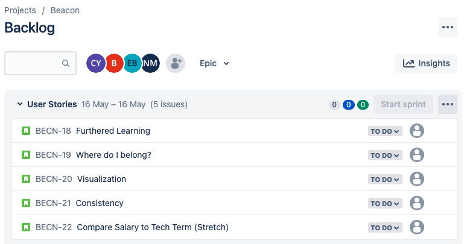
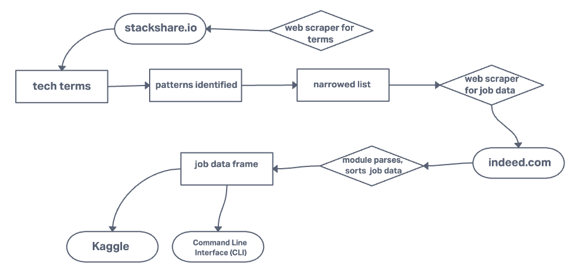

# Tech Spotlight / Beacon

## Project Authors

Benjamin Carter, Eden Brekke, Nicholas Mercado, Christopher Yamas

## User Stories

    *Above: a screenshot of the user stories in Jira project backlog*

### 1. Furthered Learning

- As someone who's searching for a job I want to know what technologies are most relevant in job postings, and thus where I should be focusing my learning into.
- Web scraper will grab technology terms from a number of job postings.
- Data scraped from the postings will be posted as a graph to show which terms show up most often.

### 2. Where do I belong?

- As someone who's searching for a job I would like to be able to see where to point my job search, based on my current tech stack.
- Web Scraper will show the tech terms companies are interested in.
- Data scraped will be counted to show how much each term is listed within the set.

### 3. Visualization

- As a job searcher I'm a lot more visual and would like to see the data within graphs.
- Data analysis on the web scraped data to display a graph of the terms grabbed and their relevance.
- Graph of terms and their counts will be displayed in a readable graph.

### 4. Consistency

- As someone searching for a job I want to know how frequently the technology desired is changing.
- Perform two scrapes, one at the start of the week and one a couple of days later and compare the patterns
- Display two graphs, and show the difference(if any) between the two scrapes.

### 5. Compare Salary to Tech Term (Stretch)

- As someone who's searching for a job I'd like to know how salary ranges compare between two tech skill sets.
- Web Scraper will include salary ranges listed on job listing, and data visualization will compare these two columns (tech term and salary)
- Graph will display the comparison between tech terms and salary range.

## Software Requirements

You can read the [Software Requirements](./requirements.md) for this project.

## Domain Modeling

